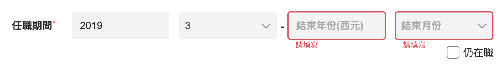

# 提升年資計畫

目標
1. 少時：每週花少許時間
2. 少工：單純提取 wysiwyg, 努力要當下兌現
3. 目標化學習：取代過去無腦努力，目標要精煉

課程設計

1. 程撰體：以課程為核心，三階段，單位月
    - 捨棄一般「架構式大綱」，以課程完結(3mx4c)為目標
    - 可修正目標釋出：大綱式無法調整

2. 關鍵字： Table of Contents

## 大綱

[TOC]

## 課程一

### 第三方框架釋出

#### 1. 學習框架結構

1. 以 BS 為例子
    - 學習 BS 框架三大單位體

#### 2. 學習第三方共用元件

1. 製作框架釋出
    - 變數單位
    - 框架單位
2. 釋出經驗
    - 相對路徑

#### 3. 學習第三方 - 串接1

1. 串接設定
    - vue.config
    - package.json

2. 元件製作
    - 雙向綁定
    - radio, checkbox, input

#### 4. 學習第三方 - 串接2

1. 元件製作
    - selector
    - tag
    - 結合

#### 5. 表單驗證

1. 套件使用
    - vuelidate

---

### 檢討與進階 (非現在)

#### 高級表單元件

1. 超級 checkbox
2. FormDropdown (survey)
3. FormTextareaCounter

#### 表單驗證

1. 仍在職

    - checkbox + selector + 驗證

## 課程二

### 前端架構設計

#### CSS 設計模式

- 終極目標
    - tailwind 的使用加上驗證
    - 為什麼需要 tailwind

#### 模組化
- 模祖化的歷史
- 打包
- webpack

#### 基礎架構

1. middleware (meet)
    - 遞迴器
    - 頁面檢核器
    - remember: 最少時間，會動就好

2. api 套件
    - axios
    - pinia

#### Vue3

vue3-cli : vue3 + tailwind + pinia

## 課程三

### 架構與模式

#### 1. 設計模式 && class
#### 2. 泛型 && TS
#### 3. 物件導向 與 函式編成

- 讓阿貴痛罵 vue3
    - option API vs Composition API
- React Hook
    - 教學
    - 實作課程
        - Hook vs Mixin

#### 4. 架構設計
1. 什麼是架構設計
    - 參考有名的架構設計
    - 什麼時候需要使用這個名詞
    - 「前端」的架構設計
        - 研究資源 / 課程
        - 可以解決什麼問題
2. 主流技術思考
    - 微服務
    - 中台服務
        - 怎麼跟後端合作
    - DDD
    
---

## 課程 N

### 尚未定義

#### 編輯器

- 前端要有 sense
    - 至少要知道的項目與應用

0. ck-editor
1. quill.js
2. wysiwyg 系列
    - react
3. cakeresume
    - 使用的編輯器

